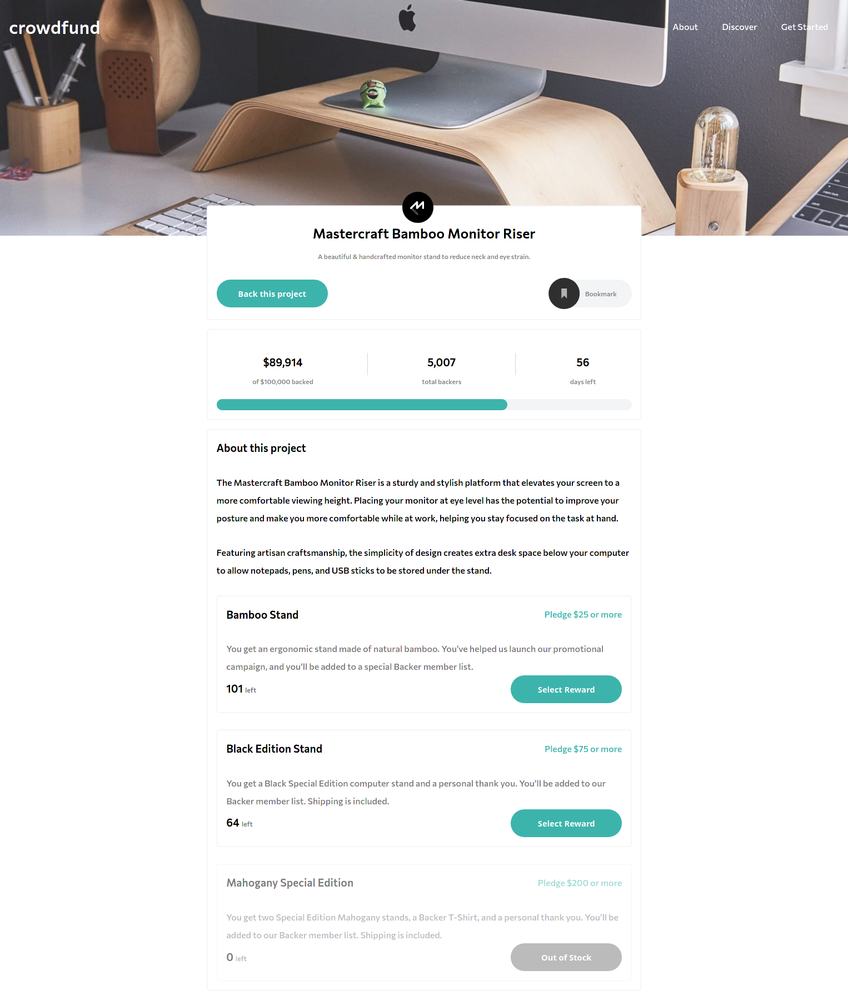

# Frontend Mentor - Crowdfunding product page solution

This is a solution to the [Crowdfunding product page challenge on Frontend Mentor](https://www.frontendmentor.io/challenges/crowdfunding-product-page-7uvcZe7ZR). Frontend Mentor challenges help you improve your coding skills by building realistic projects. 

## Table of contents

- [Overview](#overview)
  - [The challenge](#the-challenge)
  - [Screenshot](#screenshot)
  - [Links](#links)
- [My process](#my-process)
  - [Built with](#built-with)
  - [What I learned](#what-i-learned)
  - [Continued development](#continued-development)
  - [Useful resources](#useful-resources)
- [Author](#author)
- [Acknowledgments](#acknowledgments)

## Overview

### The challenge

Users should be able to:

- View the optimal layout depending on their device's screen size
- See hover states for interactive elements
- Make a selection of which pledge to make
- See an updated progress bar and total money raised based on their pledge total after confirming a pledge
- See the number of total backers increment by one after confirming a pledge
- Toggle whether or not the product is bookmarked

### Screenshot

### Links

- Solution URL: [Source Code](https://github.com/scjuly19/crowdfunding-product-page-main.git)
- Live Site URL: [Website](https://tender-minsky-dc3c00.netlify.app)

## My process
I started with creating a basic html structure for the page and then added styling using scss. In styles, first I added the basic styling and then proceeded with writing the media queries for making a responsive layout. And then added the functionality using vanillaJS. 
### Built with

- Semantic HTML5 markup
- CSS custom properties
- Flexbox
- CSS Grid
- Mobile-first workflow
- SCSS

### What I learned

I have learned some basic concepts of SCSS. I used mixins,extend and variables in SCSs to avoid writing the styles again and again. Looking forward to learn more and write it with better practices next time!

### Continued development

I will focus on best practices for writing SCSS and modify it as I learn them.

## Author

- Website - [Sakshi Chaudhary](https://www.your-site.com)
- Frontend Mentor - [@scjuly19](https://www.frontendmentor.io/profile/yourusername)

